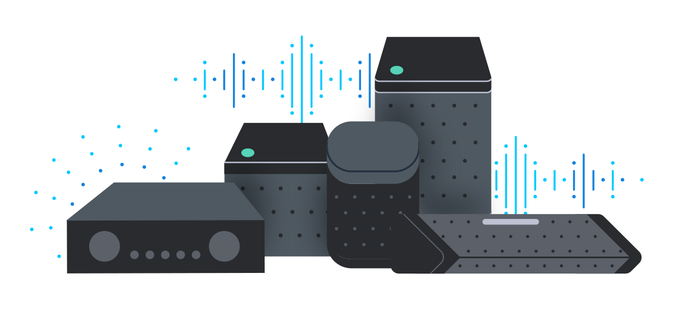

# AWS IoT Device Management Builders Session

In this session, you are a device speaker and headphone manufacturer looking to deploy cloud connectivity to millions of devices.
You have decided to do a proof of concept on device management capabilities of AWS and how these might make provisioning and managing this large fleet of connected speakers much easier.

In the workshop you will learn the basics of enabling logging, bulk provisioning devices, using device jobs to update a device, enabling indexing on your device fleet, and grouping your devices for easier management.

The session is designed to be conducted on an EC2 instance which will be provisioned through AWS CloudFormation. Amazon Linux is used as operating system and the standard user is named *ec2-user*.

Scripts that you will use in the workshop are copied into the directory *~/bin* of the user *ec2-user* on your EC2 instance.

For several exercises the aws command line interface (awscli) is used. It is installed and configured automatically on the EC2 Instance.

## Workshop Agenda

* [Prerequisites](#Prerequisites)
* [Setup Lab with CloudFormation](#Setup_Lab_with_CloudFormation)
* [Enable Logging for AWS IoT](#Enable_Logging_IoT)
* [Enable Registry Events](#Registry_Events)
* [Device Provisioning with the API](#Device_Provisioning_with_the_API) - optional
* [Single Device Provisioning](#Single_Device_Provisioning) - optional
* [Bulk Device Provisioning](#Bulk_Device_Provisioning)
* [IoT Jobs](#IoT_Jobs)
* [Fleet Indexing](#Fleet_Indexing)
* [Thing Groups](#Thing_Groups)
* [Fine-Grained Logging](#Fine-Grained_Logging) - optional
* [Clean Up](#Cleanup) - can be done after lab

[[Top](#Top)]
## Prerequisites
For this workshop you will need the following tools/setup/knowledge:

* AWS Account and account/role with administrative permissions
* Secure shell (ssh) to login into the EC2 instance
	* Mac OS/Linux: command lines tools are installed by default
	* Windows
		* Putty: ssh client: <http://www.putty.org/>
		* Manual connect (ssh) to an EC2 instance from Windows with Putty: <http://docs.aws.amazon.com/AWSEC2/latest/UserGuide/putty.html>
* A ssh key-pair to be able to log into the EC2 instance
	* a ssh key-pair can be generated or imported in the AWS console under *EC2 -> Key Pairs*
* Basic Linux knowledge for moving around in file systems, executing shell commands and using shell variables

### AWS Account
It is highly recommended that you use a sandbox account or development account for this session. Do not use a production account!

[[Top](#Top)]
## Lab Setup with AWS CloudFormation

For the exercises in this workshop an EC2 instance will be used to simulate the connected speakers. We do provide a [CloudFormation](https://docs.aws.amazon.com/AWSCloudFormation/latest/UserGuide/Welcome.html) stack to create an EC2 instance and other AWS resources required for this workshop.
Click on the AWS region where you want to launch your stack. For this lab we will use us-east-1

By choosing one of the links below you will be automatically redirected to the CloudFormation section of the AWS Console where your stack will be launched.

#### Prior to launch the CloudFormation stack you need to have:

* **An ssh key pair to log into the EC2 instance. If you don't have an ssh key pair you can create one in the**

	=> *EC2 console -> Key pairs*

The CloudFormation Stack creates the following resources:

* **S3 Bucket** required for Bulk Provisioning
* **IoT Policy** for provisioning scenarios
* **VPC with public subnet + Security Group** for an EC2 instance
* **EC2 instance** where you will do this lab
* **Instance Profile** for your EC2
* **IAM roles** required for provisioning scenarios and to enable IoT logging

---

### Prepare the environment

#### Launch the CloudFormation stack
This AWS Cloudformation Template will setup the lab environment with an EC2 instance, IoT roles and S3 Bucket and other resources for the lab. It will also pull an archive with all required files from Amazon S3.

Choose **one** of the following regions to launch the CloudFormation stack.
The link will guide you directly to the AWS CloudFormation console

 **us-east-1 (N. Virginia, US)**

 **us-west-2 (Oregon, US)**

 **eu-west-1 (Dublin, Ireland)**

After you have been redirected to the AWS CloudFormation console take the following steps to launch your stack:

1. Next
2. Stack name: **iotbuildersession**
3. Parameters
4. **Select SSH Key** (If you don't already have an ssh key, create a new one. Don't forget this or you won't be able to get into your instance!)
5. Next
6. Next
7. Under Capabilities section
8. Check "I acknowledge that AWS CloudFormation might create IAM resources." at the bottom of the page
9. Click Create
10. If the stack does not appear immediately hit the refresh button in the upper right corner
11. Click on **iotbuildersession**
12. Wait until the complete stack has been created, it will take between 3-5 minutes

If you notice any error(s) during stack creation look for the root cause in the Events section of the CloudFormation console. The most common error is to run into service limits.

In the **Outputs** section for your stack in the CloudFormation console you find several values for resources that has been created. These values will be used during the workshop:

* Name of an S3 bucket
* Name of an IoT policy
* ARN of a role that is used for device provisioning
* SSH login information

You can go back at any time to the Outputs section to get these values.

* ssh into your instance
	* you can find the hostname in the outputs section of the CloudFormation console or find the instance under the EC2 service

  > ssh -i <your key> <instance hostname or public IP>

* Confirm the following exist in the ec2-user home directory:
	* bin
	* CA
	* job-agent
	* templateBody.json

[[Top](#Top)]
## Enable Logging for AWS IoT

AWS IoT sends progress events about each message as it passes from your devices through the message broker and the rules engine. To view these logs, you must configure AWS IoT to generate the logs used by CloudWatch.

To enable [AWS IoT logging](https://docs.aws.amazon.com/iot/latest/developerguide/cloud-watch-logs.html), you must create an IAM role, register the role with AWS IoT, and then configure AWS IoT logging.

Go to the AWS IoT console by logging into your AWS account and going to the AWS IoT Core Service. Also make sure that you are in the same region where you deployed the AWS Cloudformation stack.

1. Get started (only if no resources are provisioned)
2. Settings
3. Logs (if DISABLED) -> Edit
4. Change "Level of verbosity" to "Warnings"
5. Set role -> Select "AWSIoTLoggingServices"
6. Update

AWS IoT log files will now be sent to a log group in **Amazon CloudWatch Logs** called AWS **AWSIotLogsV2**.

[[Top](#Top)]
## Enable IoT Registry Events
The [Registry publishes event messages](https://docs.aws.amazon.com/iot/latest/developerguide/registry-events.html) when things, thing types, and thing groups are created, updated, or deleted.
Each event causes a single event message to be published by the service. Messages are published over MQTT with a JSON payload. The content of the payload depends on the type of event.

The device registry posts messages to

	$aws/events/#

for several actions, e.g. when things are created/updated/deleted.

**In this exercise** you will enable IoT Events. You will use IoT Events in the following exercises in this workshop.

#### Get current event configuration

With the following command you can determine which IoT Events are enabled/disabled

	aws iot describe-event-configurations

#### Enable all events
Use the following command to enable all events:

	aws iot update-event-configurations --cli-input-json \
	'{
	    "eventConfigurations": {
	        "THING_TYPE": {
	            "Enabled": true
	        },
	        "JOB_EXECUTION": {
	            "Enabled": true
	        },
	        "THING_GROUP_HIERARCHY": {
	            "Enabled": true
	        },
	        "CERTIFICATE": {
	            "Enabled": true
	        },
	        "THING_TYPE_ASSOCIATION": {
	            "Enabled": true
	        },
	        "THING_GROUP_MEMBERSHIP": {
	            "Enabled": true
	        },
	        "CA_CERTIFICATE": {
	            "Enabled": true
	        },
	        "THING": {
	            "Enabled": true
	        },
	        "JOB": {
	            "Enabled": true
	        },
	        "POLICY": {
	            "Enabled": true
	        },
	        "THING_GROUP": {
	            "Enabled": true
	        }
	    }
	}'

Now re-run the describe command to confirm these are enabled:
	aws iot describe-event-configurations

[[Top](#Top)]
## Device Provisioning with the Command Line and API
**In this exercise** you will execute all the required commands to create and register a device with AWS IoT. You will also learn how registry events work.

A device that should be able to communicate with AWS IoT over MQTT needs to have a X.509 certificate which is registered with AWS IoT as well as an IoT policy. X.509 certificates are used for authentication and the IoT policy for authorization.

Several API calls are required to provision a device. The output for some commands are stored in files in /tmp because the outputs are required for further steps in the provisioning process.

In the previous section you have enabled IoT Events. To see the messages that the device registry publishes subscribe to the related topic hierarchy. Use the built-in MQTT client in the AWS console to subscribe to topics.

* Login to your AWS account and go to the AWS IoT console

	1. Click Test
	2. Subscribe to a topic
	3. Subscription topic: **$aws/events/#**
	4. Subscribe to topic

### Get root CA certificates

Server certificates allow your devices to verify that they're communicating with AWS IoT and not another server impersonating AWS IoT: <https://docs.aws.amazon.com/iot/latest/developerguide/managing-device-certs.html>

A shell script is provided on the EC2 instance to download the CA certificates.

* ssh into your EC2 instance and run the following command:

		create-root-ca-bundle.sh

The CA certificates are stored as **$HOME/root.ca.bundle.pem**

### Create a Device

Use API calls to provision a device. A device is provisioned in AWS IoT when it has been created in the device registry, a device certificate has been registered and attached to the device, an IoT policy has been attached to the device.

* ssh into your EC2 instance:

		# putting your thing name into variable makes the next steps easier
		THING_NAME=speaker-test

		# create a thing in the thing registry
		aws iot create-thing --thing-name $THING_NAME

* Go to the AWS IoT console:
You should see a message that was posted to

		$aws/events/thing/$THING_NAME/created

* Back to your EC2 instance:

		# create key and certificate for your device and activate the device
		aws iot create-keys-and-certificate --set-as-active \
		  --public-key-outfile $THING_NAME.public.key \
		  --private-key-outfile $THING_NAME.private.key \
		  --certificate-pem-outfile $THING_NAME.certificate.pem > /tmp/create_cert_and_keys_response

		# look at the output from the previous command
		cat /tmp/create_cert_and_keys_response

		# output values from the previous call needed in further steps
		CERTIFICATE_ARN=$(jq -r ".certificateArn" /tmp/create_cert_and_keys_response)
		CERTIFICATE_ID=$(jq -r ".certificateId" /tmp/create_cert_and_keys_response)
		echo $CERTIFICATE_ARN
		echo $CERTIFICATE_ID

		# create an IoT policy
		POLICY_NAME=${THING_NAME}_Policy
		aws iot create-policy --policy-name $POLICY_NAME \
		  --policy-document '{"Version":"2012-10-17","Statement":[{"Effect":"Allow","Action": "iot:*","Resource":"*"}]}'

		# attach the policy to your certificate
		aws iot attach-policy --policy-name $POLICY_NAME \
		  --target $CERTIFICATE_ARN

		# attach the certificate to your thing
		aws iot attach-thing-principal --thing-name $THING_NAME \
		  --principal $CERTIFICATE_ARN

* List things in the device registry. Use the command line as AWS IoT console might not be aware of every update made through the API

		aws iot list-things

### Update the Device
To update the device you just created, add an attribute. Also this modification of the device causes the device registry to publish an event message.

* Update the device

		aws iot update-thing --thing-name $THING_NAME --attribute-payload '{"attributes": {"type": "ws-device"}}'

* Look at your device

		aws iot list-things

* Go to the AWS IoT console:
You should see a message that was posted to

		$aws/events/thing/$THING_NAME/updated

### Publish a message to your newly created device
After your device has been provisioned you will publish a message to AWS IoT. To publish a message the command *mosquitto_pub* is used. This command requires the iot endpoint as a parameter.

* In the console, Subscribe to the topic **iot/ws**

* Go to the AWS IoT Console

	1. Test
	2. Subscribe to a topic
	3. Subscription topic: **iot/ws**
	4. Subscribe to topic

* Go to your EC2 instance:

		# the iot endpoint has been already assigned to the shell variable $IOT_ENDPOINT but you can also view it with the following command:
		aws iot describe-endpoint

		# during setup of the EC2 instance the iot endpoint has already been assigned to the shell variable IOT_ENDPOINT

		# publish a message
		mosquitto_pub --cafile ~/root.ca.bundle.pem \
		--cert $THING_NAME.certificate.pem \
		--key $THING_NAME.private.key -h $IOT_ENDPOINT -p 8883 \
		-q 0 -t iot/ws -i $THING_NAME --tls-version tlsv1.2 \
		-m "{\"volume\": \"8\", \"date\": \"$(date)\"}" -d

* Go to the AWS IoT Console and check if a message has arrived

[[Top](#Top)]
## Single Device Provisioning
**In this exercise** you will provision a single device with the [*register-thing*](https://docs.aws.amazon.com/iot/latest/developerguide/programmatic-provisioning.html) API call. In this provisioning example the thing will be assigned to a thing group and a thing type will be assigned. **Group and type must exist before the provisioning is started**.

Provision a thing with a single API call (register-thing) and a provisioning template. A key for the device and a CSR are also required to provision the device.

You will find a provisioning template in your home directory. The filename is *templateBody.json*

Create keys, CSR and input parameter with the script *mk-prov.sh* for a single device. The output is applied through the Parameters section in the provisioning template to the register-thing API.

The device that will be created will also be put into a thing group and a thing type will be assigned. This is done through the provisioning template. However group and type must **exist before** the provisioning process starts.

* Create a thing group in AWS IoT

		aws iot create-thing-group --thing-group-name speakers-group

* Create a thing type in AWS IoT

		aws iot create-thing-type --thing-type-name speakers-type \
		--thing-type-properties "thingTypeDescription=connected speaker,\
		 searchableAttributes=alexaenabled,model"

* Create key, CSR and parameters:

		# set your thing name
		THING_NAME=speaker-test2

		mk-prov.sh $THING_NAME

* Provision the thing. Copy the output between the curly brackets including the curly brackets and replace it in the following command in the --parameters section

		aws iot register-thing --template-body file://templateBody.json --parameters '[OUTPUT_FROM_THE_PREVIOUS_COMMAND]'

[[Top](#Top)]
## Bulk Device Provisioning
**In this exercise** you will bulk provision multiple things with one API call: [*start-thing-registration-task*](https://docs.aws.amazon.com/iot/latest/developerguide/bulk-provisioning.html)

The API call **start-thing-registration-task** can be used to provision things in bulk. To provision things in bulk you need the same parameters as with single device provisioning with the **register-thing** API call. But you will put multiple parameters into file which then must be stored in an Amazon S3 bucket.

An IAM role is also required to allow AWS IoT to access the S3 bucket and provision devices in your account. The role was created already through CloudFormation. You can find the required role ARN in the outputs section of the CloudFormation stack.

The parameters file which you need to store in the Amazon S3 bucket contains the values used to replace the parameters in the template. The file must be a newline-delimited JSON file. Each line contains all of the parameter values for provisioning a single device.

You can create keys, CSR and input parameter with the script *mk-bulk.sh* for multiple devices. The script mk-bulk.sh will create a directory and put all the keys, CSRs and a file **bulk.json** into this directory.

To perform bulk provisioning the required S3 bucket must exist in the **same region** where the devices will be provisioned. This bucket was already created for the workshop and can be found in the shell variable **S3_BUCKET**

* Create keys and CSRs:

		THING_NAME=speakers

		# number of things to create
		NUM_THINGS=10

		mk-bulk.sh $THING_NAME $NUM_THINGS

* Keys, CSRs and the file **bulk.json** are created in a directory with the naming-scheme *$THING_NAME-YYYY-mm-dd_H-M-S*

* Copy the file *bulk.json* to your S3 bucket and verify that it was copied. The name of your S3 bucket has been copied during the setup of the workshop to the shell variable *S3_BUCKET*

		# cd to the directory where keys/CSRs where created
		cd $THING_NAME-YYYY-mm-dd_H-M-S

		# copy bulk.json to S3
		aws s3 cp bulk.json s3://$S3_BUCKET/

		# verify that the file was copied
		aws s3 ls s3://$S3_BUCKET/

* Create a bulk thing registration task. The name of your role has been copied during the setup of the workshop to the shell variable *$ARN\_IOT\_PROVISIONING\_ROLE*

		aws iot start-thing-registration-task \
		  --template-body file://~/templateBody.json \
		  --input-file-bucket $S3_BUCKET \
		  --input-file-key bulk.json --role-arn $ARN_IOT_PROVISIONING_ROLE

* If the command is successful you'll get back a task-id. You can verify the state of the task for ERRORS or RESULTS with the following commands:

		aws iot list-thing-registration-task-reports \
		  --report-type ERRORS --task-id [YOUR_TASK_ID]

		aws iot list-thing-registration-task-reports \
		  --report-type RESULTS --task-id [YOUR_TASK_ID]

* If you get output from the report-type RESULTS from the command above you can download the output for this command from a URL. The output will be stored in the file **results.json**

		wget -O results.json $(aws iot list-thing-registration-task-reports --task-id [YOUR_TASK_ID] --report-type RESULTS | jq -r '.resourceLinks[]')

* If you encounter errors use the following command to download the error messages. They are stored in the file **errors.json**. Examine the messages and solve the root cause.

		wget -O errors.json $(aws iot list-thing-registration-task-reports --task-id [YOUR_TASK_ID] --report-type ERRORS | jq -r '.resourceLinks[]')

* Take a look at the file **results.json**
* Write all the certificates from the file results.json to files for the related thing. Do it on your own or use a python script that we have prepared

		bulk-result.py results.json

* Verify that the certificates have been written

		ls -l

* List the things in the AWS IoT device registry

		aws iot list-things

* Now try to publish with one of the things that you created. Subscribe to the topic "iot/ws" before

		# replace XX with a number of the things you created
		THING_NAME=speakersXX

		mosquitto_pub --cafile ~/root.ca.bundle.pem \
		  --cert $THING_NAME.crt --key $THING_NAME.key \
		  -h $IOT_ENDPOINT -p 8883 -q 0 -t iot/ws \
		  -i $THING_NAME	 --tls-version tlsv1.2 \
		  -m "{\"prov\": \"bulk\", \"date\": \"$(date)\"}" -d

[[Top](#Top)]
## IoT Jobs

In this section of the Lab, you will have your speakers run an update job that will install a python library to enable communication with the Spotify music service. This is a task that you would like to carry out across the fleet of speakers, but first need to understand how it would work on one of them using IoT Device Management Jobs feature.

[AWS IoT Jobs](https://docs.aws.amazon.com/iot/latest/developerguide/iot-jobs.html) is a service that allows you to define a set of remote operations that are sent to and executed on one or more devices connected to AWS IoT. It also provides mechanisms for monitoring and rate limiting the number of devices that the jobs get executed on and has ability to run ongoing jobs or one-time jobs.

#### Job Topics
AWS IoT provides an MQTT API for jobs and uses the following topics:

* $aws/things/\<thingName\>/jobs/notify (or $aws/things/\<thingName\>/jobs/notify-next)
* $aws/things/\<thingName\>/jobs/get/accepted
* $aws/things/\<thingName\>/jobs/get/rejected
* $aws/things/\<thingName\>/jobs/jobId/get/accepted
* $aws/things/\<thingName\>/jobs/jobId/get/rejected

**In this exercise** you will create a job which will be gathered by a sample job agent. The job agent then acts based on the contents of the job document. The job agent uses the MQTT API to retrieve jobs and also to report the result of the executed job.
You will find the job agent here: *~/job-agent/job-agent.py*

* **Provision a device** with one of the options that you have learned in the **previous exercises** and put the root.ca.bundle.crt, device key and device cert into the directory *~/job-agent/*. E.g:

		cd ~/job-agent/
		THING_NAME=speakers-job
		aws iot create-thing --thing-name $THING_NAME
		aws iot create-keys-and-certificate --set-as-active \
		  --public-key-outfile $THING_NAME.public.key \
		  --private-key-outfile $THING_NAME.private.key \
		  --certificate-pem-outfile $THING_NAME.certificate.pem > /tmp/create_cert_and_keys_response
		CERTIFICATE_ARN=$(jq -r ".certificateArn" /tmp/create_cert_and_keys_response)
		CERTIFICATE_ID=$(jq -r ".certificateId" /tmp/create_cert_and_keys_response)
		POLICY_NAME=${THING_NAME}_Policy
		aws iot create-policy --policy-name $POLICY_NAME \
		  --policy-document '{"Version":"2012-10-17","Statement":[{"Effect":"Allow","Action": "iot:*","Resource":"*"}]}'
		aws iot attach-policy --policy-name $POLICY_NAME \
		  --target $CERTIFICATE_ARN
		aws iot attach-thing-principal --thing-name $THING_NAME \
		  --principal $CERTIFICATE_ARN

* List things in the device registry. Don't trust the AWS IoT console. It might not be aware of every update made through the API

		aws iot describe-thing --thing-name $THING_NAME

* **Start the sample job agent**. To start the job agent you need to provide on the command line the client-id, iot-endpoint, ca certificate, device key and certificate

		# when you have used the commands above to create the device
		./job-agent.py -c $THING_NAME -i $IOT_ENDPOINT \
		  --cacert ~/root.ca.bundle.pem --cert $THING_NAME.certificate.pem \
		  --key $THING_NAME.private.key

Go to the AWS IoT Console

1. Test
2. Subscribe to a topic
3. Subscription topic: **$aws/events/#**
4. Subscribe
5. Subscribe to a topic
6. Subscription topic: **$aws/things/#**
7. Subscribe
8. Subscribe to a topic
9. Subscription topic: **music/updates**
10. Subscribe

#### Sample job document
The following sample job document was already copied to your EC2 instance to *~/job-agent/job-document.json*

{
    "operation": "spotify",
    "spotify": "pip install --user spotipy",
    "topic": "music/updates"
}

The job document is setup so that it will install a new music package on to the device so that it can communicate with spotify and report back to AWS IoT Core on *music/updates*

* ssh into the EC2 instance in an additional session. The job agent running in another session should not be interrupted.
* Copy the job document to your S3 Bucket

		cd ~/job-agent/
		# copy the document
		aws s3 cp job-document.json s3://$S3_BUCKET/

		# verify that the document has been copied
		aws s3 ls s3://$S3_BUCKET/

* Create a job. The job id that you choose must be unique. It is not possible to reuse a job id.

		# retrieve the arn for the job device,
		# e.g. through list-things, describe-thing, "Manage" in the AWS IoT console

		THING_NAME=speakers-job
		aws iot describe-thing --thing-name $THING_NAME

		JOB_THING_ARN=[ARN_OF_YOUR_JOB_THING]

		# define a unique job id
		JOB_ID=[an_id_e.g. 468]

		# finally create the job
		aws iot create-job --job-id  $JOB_ID \
			--targets $JOB_THING_ARN \
			--document-source https://s3.amazonaws.com/$S3_BUCKET/job-document.json  \
			--presigned-url-config "{\"roleArn\":\"$ARN_IOT_PROVISIONING_ROLE\", \"expiresInSec\":3600}"

* You should receive an output similar to the following:

		{
		    "jobArn": "arn:aws:iot:[AWS_REGION]:[AWS_ACCOUNT_ID]:job/$JOB_ID",
		    "jobId": "$JOB_ID"
		}

* Watch the output of the job-agent.py in the other session
* As long as there are no jobs present you should find a log line which contains:
	* **callback\_jobs\_get\_accepted - NO jobs available**
* After you have created your job you should see more activity in the logs. When a job is available you should find a log line containing:
	* **callback\_jobs\_get\_accepted - JOBS AVAILABLE**
* Feel free to create more jobs

Once the job has completed you can check back on the topic subscriptions to review the messages. on the events topic, you should see a message for this job. verify that you see:

"numberOfSucceededThings": 1,

Also, go back to the console and verify that the python package for Spotify was installed by re-running the job command

	pip install --user spotipy

You should see that it was already installed via the job:

	Requirement already satisfied: requests>=1.0 in /usr/lib/python2.7/dist-packages (from spotipy) (1.2.3)

[[Top](#Top)]
## Fleet Indexing
[Fleet Indexing](https://docs.aws.amazon.com/iot/latest/developerguide/iot-indexing.html) is a managed service that allows you to index and search your registry and shadow data in the cloud. After your fleet index is set up, the service manages the indexing of all your registry and shadow updates. You can use a simple query language based on the popular open source search engine, Apache Lucene, to search across this data.

**In this exercise** you will enable fleet indexing for the registry and the shadow and then perform searches in the registry.

Let's assume you manage a fleet of connected home speakers and want to find out which ones are currently in use.

We will simulate "now playing" on the devices by adding reported songs that are playing to the device shadows and adding also a room attribute to devices. We will use the devices that you have created in the bulk provisioning exercise.

* Enable fleet indexing for the registry and shadow

		aws iot update-indexing-configuration \
		  --thing-indexing-configuration thingIndexingMode=REGISTRY_AND_SHADOW

* Verify if fleet indexing is enabled for both registry and shadow.

		aws iot get-indexing-configuration

* Add "now playing" to the device shadow and room the device is located in to the device. We provide a small script that modifies all things matching the thing name *"name\*"*. Use the devices that you have created in the bulk provisioning exercise. We assume that you have used the thing name *speakers* in the earlier bulk provisioning exercise. If another name has been used, change the name in the following command accordingly.

		# add song that is "now playing" and room
		# to all devices matching the name "speakers*"
		# if you have named the devices in the bulk provisioning section
		# differently, choose the appropriate basename
		fleet-indexing.py -b speakers

	If you get an **error message** containing *Creation of index AWS_Things is in progress* it means that the indexing process has not finished yet. Wait some minutes and try again.

* Verify that the modification was successful. Every device from the bulk provisioning exercise should have an attribute *room*

		aws iot search-index --query-string "thingName:speakers*"

* Find all device in the registry that are now playing music by Chris Cornell:

		aws iot search-index \
		--query-string "shadow.reported.nowplaying:Chris Cornell* AND attributes.room:*"

* You can also find the shadow document for a device in the AWS IoT Console:

	1. Go to the AWS IoT Console
	2. Manage
	3. Things
	4. Click on a thing
	5. Shadow
	6. Find the shadow state in the shadow document

[[Top](#Top)]
## Thing Groups
[Thing groups](https://docs.aws.amazon.com/iot/latest/developerguide/thing-groups.html) allow you to manage several things at once by categorizing them into groups.

Imagine you have millions of smart speakers you want to provision that are already being used by customers. Instead of applying a device policy to every speaker, you can group them by smarthome and apply and manage the policy based on that customer's device home.

**In this exercise** you will learn how you can authorize devices by attaching an IoT policy to a thing group instead to a device certificate. The policy attached to the thing group will make use of policy variables so that a device is only allowed to publish to:

	telemetry/smarthome/one/${iot:ClientId}

Create a thing group policy, attach the policy to the thing group, create a device and add the device to the thing group.

* Go to your EC2 instance:

		# create a thing group
		THING_GROUP_NAME=smarthome
		aws iot create-thing-group \
		  --thing-group-name $THING_GROUP_NAME > /tmp/create_group_response
		GROUP_ARN=$(jq -r ".thingGroupArn" /tmp/create_group_response)

		# get your AWS account id. It is required for the IoT policy in this example
		ACCOUNT_ID=$(aws sts get-caller-identity | jq -r '.Account')

		# create IoT policy
		POLICY_NAME=smarthome_Policy
		aws iot create-policy --policy-name $POLICY_NAME \
		--policy-document "{\
	    \"Version\": \"2012-10-17\",\
	    \"Statement\": [{\
	        \"Effect\": \"Allow\",
	        \"Action\": [\"iot:Connect\"],\
	        \"Resource\": [\
	            \"arn:aws:iot:$AWS_REGION:$ACCOUNT_ID:client/\${iot:ClientId}\"\
	        ]\
	    },\
	    {\
	        \"Effect\": \"Allow\",\
	        \"Action\": [\"iot:Publish\"],\
	        \"Resource\": [\
	            \"arn:aws:iot:$AWS_REGION:$ACCOUNT_ID:topic/telemetry/smarthome/one/\${iot:ClientId}\"\
	        ]\
	      }]\
	  	}"

		# attach policy to thing group
		aws iot attach-policy \
		  --target $GROUP_ARN \
		  --policy-name $POLICY_NAME

		# verify that the policy was attached to the thing group
		aws iot list-attached-policies --target $GROUP_ARN

* Create a thing as well as key and certificate. Choose any method that you have learned earlier. **But DO NOT attach a policy to the device certificate**

		cd
		THING_NAME=speaker-group-member
		aws iot create-thing --thing-name $THING_NAME
		aws iot create-keys-and-certificate --set-as-active \
		  --public-key-outfile $THING_NAME.public.key \
		  --private-key-outfile $THING_NAME.private.key \
		  --certificate-pem-outfile $THING_NAME.certificate.pem > /tmp/create_cert_and_keys_response
		CERTIFICATE_ARN=$(jq -r ".certificateArn" /tmp/create_cert_and_keys_response)
		CERTIFICATE_ID=$(jq -r ".certificateId" /tmp/create_cert_and_keys_response)
		aws iot attach-thing-principal --thing-name $THING_NAME \
		  --principal $CERTIFICATE_ARN

* Add your thing to the thing group

		aws iot add-thing-to-thing-group \
		  --thing-name $THING_NAME \
		  --thing-group-name $THING_GROUP_NAME

		# list things in your group
		aws iot list-things-in-thing-group \
		  --thing-group-name $THING_GROUP_NAME

* Subscribe in the AWS IoT console to **telemetry/smarthome/one/#**
* Publish a message to the topic *telemetry/smarthome/one/$THING_NAME*. You should see that the message is arriving.

		mosquitto_pub --cafile ~/root.ca.bundle.pem \
		  --cert $THING_NAME.certificate.pem \
		  --key $THING_NAME.private.key -h $IOT_ENDPOINT -p 8883 \
		  -q 0 -t telemetry/smarthome/one/$THING_NAME -i $THING_NAME --tls-version tlsv1.2 \
		  -m "{\"group\": \"test\", \"date\": \"$(date)\"}" -d

* Publish a message to another topic, this messages should not arrive.

		mosquitto_pub --cafile ~/root.ca.bundle.pem \
		  --cert $THING_NAME.certificate.pem \
		  --key $THING_NAME.private.key -h $IOT_ENDPOINT -p 8883 \
		  -q 0 -t telemetry/smarthome/one/${THING_NAME}_test -i $THING_NAME --tls-version tlsv1.2 \
		  -m "{\"group\": \"test\", \"date\": \"$(date)\"}" -d

[[Top](#Top)]
## Fine-Grained Logging

Imagine scenarios where your engineering support team wants to debug issues related to a specific speaker or set of smart speakers within a home. Turning on debug level logging across the fleet of millions of devices to debug one device is not practical. Using device groups for logging allows you to turn on higher levels of logging for only devices within the group.

[Fine-grained logging](https://docs.aws.amazon.com/iot/latest/developerguide/cloud-watch-logs.html) allows you to specify a logging level for a target. A target is defined by a resource type and a resource name. Currently, AWS IoT supports thing groups as targets. Fine-grained logging allows you to set a logging level for a specific thing group. Fine-grained logs are stored in Cloudwatch logs in the log group: *AWSIotLogsV2*.

**In this exercise** you will learn how to set the log level for a thing group that is different from the global log level. The global log level has been set to WARN. For a particular thing group you will set a more verbose log level. Then you will create some log entries by publishing messages with the device you used in the previous section. Then you will use different filters to search the logs.

* Use the thing group *smarthome* that you have created earlier

		THING_GROUP_NAME=smarthome

* Get the current logging configuration

		aws iot get-v2-logging-options

* Set the logging level to DEBUG for the thing group

		aws iot set-v2-logging-level --log-level DEBUG \
	  	  --log-target "{\"targetType\": \"THING_GROUP\", \"targetName\": \"$THING_GROUP_NAME\"}"

	  	# verify the logging level
	  	aws iot list-v2-logging-levels

* Publish messages like you did in the previous section to a topic where you are allowed to publish and also to topics where you don't have permissions to publish
* Wait some minutes because it can take a small amount of time until logs are delivered to CloudWatch
* Now let's search in the logs for events in the last hour

		# calculate the milliseconds since the epoch minus 1h
		starttime=$(($(($(date '+%s') - 3600)) * 1000))

		# search all logs in the last hour without any filters
		aws logs filter-log-events --log-group-name AWSIotLogsV2 \
		  --start-time $starttime

		# search all logs where the log level is INFO
		aws logs filter-log-events --log-group-name AWSIotLogsV2 \
		  --start-time $starttime --filter-pattern "{$.logLevel = INFO}"

		# search all logs where the log level is ERROR
		aws logs filter-log-events --log-group-name AWSIotLogsV2 \
		  --start-time $starttime --filter-pattern "{$.logLevel = ERROR}"

		# search for log entries from your thing used
		aws logs filter-log-events --log-group-name AWSIotLogsV2 \
		  --start-time $starttime --filter-pattern "{$.clientId = $THING_NAME}"

[[Top](#Top)]
## Clean Up
With the following steps you can delete the resources created during the workshop.

### On your EC2 instance issue the following commands:

#### Disable all events
Use the following command to disable all events:

	aws iot update-event-configurations --cli-input-json \
	'{
	    "eventConfigurations": {
	        "THING_TYPE": {
	            "Enabled": false
	        },
	        "JOB_EXECUTION": {
	            "Enabled": false
	        },
	        "THING_GROUP_HIERARCHY": {
	            "Enabled": false
	        },
	        "CERTIFICATE": {
	            "Enabled": false
	        },
	        "THING_TYPE_ASSOCIATION": {
	            "Enabled": false
	        },
	        "THING_GROUP_MEMBERSHIP": {
	            "Enabled": false
	        },
	        "CA_CERTIFICATE": {
	            "Enabled": false
	        },
	        "THING": {
	            "Enabled": false
	        },
	        "JOB": {
	            "Enabled": false
	        },
	        "POLICY": {
	            "Enabled": false
	        },
	        "THING_GROUP": {
	            "Enabled": false
	        }
	    }
	}'

#### Delete the resources
Deleting the resources that where created during the workshop is a semi-automated process. We start with deprecating the thing type.

* First action is to deprecate the thing type as it will take round about 5 minutes to finish

		# deprecate the thing type
		aws iot deprecate-thing-type --thing-type-name speakers-type

* The things that you have created can be deleted by a script. **WARNING** this script uses the prefixes for devices in the workshop, *speakers*

**IF YOU HAVE ANY DEVICES CREATED OUTSIDE OF THIS WORKSHOP WHO'S NAMES START WITH "speakers" they will be also deleted. In case of doubt delete the resources manually!**

	clean-up.py

* Delete the remaining resources manually

		# disable indexing
		aws iot update-indexing-configuration \
  		  --thing-indexing-configuration thingIndexingMode=OFF

		# empty your S3 bucket. If the bucket is not empty deleting the CloudFormation stack will fail
		aws s3 rm s3://$S3_BUCKET --include "*" --recursive

		# delete thing group
		aws iot delete-thing-group --thing-group-name bulk-group

		# delete the smart home policy
		aws iot delete-policy --policy-name smarthome_Policy

		# get CA certificate id
		aws iot list-ca-certificates

		# inactivate CA
		aws iot update-ca-certificate \
		  --new-status INACTIVE --certificate-id [YOUR_CA_CERTIFICATE_ID]

		# delete CA
		aws iot delete-ca-certificate \
		  --certificate-id [YOUR_CA_CERTIFICATE_ID]

		# deprecation of thing-type needs 5min. If this command is not successful, wait and try again
		aws iot delete-thing-type --thing-type-name speakers-type

* If there are any remaining resources like things, certificates, policies, etc. delete them manually

* Detach all remaining certificates from the IoT policy *$IOT_POLICY*

* Go to the AWS CloudFormation console

		Delete the iotbuildersession AWS Cloudformation stack that was created as part of this builders session
